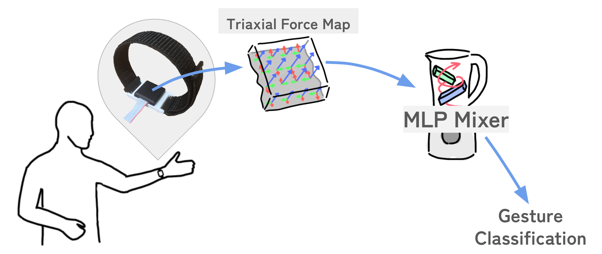
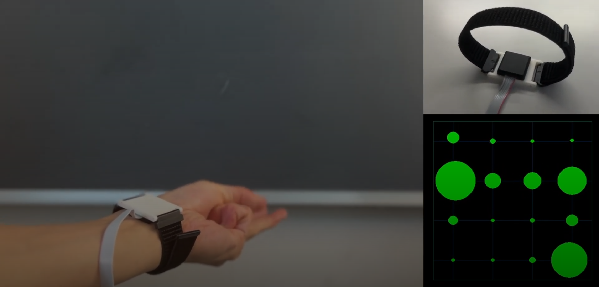
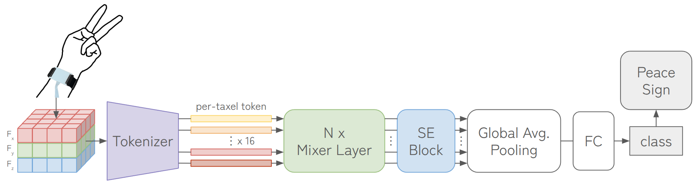

# TriForceBand
**UIST 2025 Poster**

Force Myography (FMG) offers a non-invasive method to measure muscular states, but current approaches lack in integrability with wearable devices and the capability to capture complex musculature. We introduce **TriForce Band**, a compact gesture input wristband built from a single triaxial magnetic tactile sensor module. A five-participant, ten-gesture experiment resulted with a classification accuracy of 93.0%. Our proposed MLP Mixer-style model outperforms a CNN baseline by 4.0 pp. Furthermore, introducing shear forces raised accuracy by 2.9 pp from a normal-force only distribution showing not only the importance of shear force for high accuracies, but also the pure strength of high-density normal force distribution in wrist FMG.

 

## Key Features

- 🛡️ **Non-Invasive** – FMG measures muscle activity by detecting mechanical pressure changes on the skin surface.
- 👌 **Compact** – The tactile sensor is super compact (25mm x 25mm x 5mm), making it ideal for wearable applications.
- 📈 **Data-Rich** – The tactile sensor offers high-density, triaxial force data, allowing rich mascle activity measurements.

## Model Overview

A 4 × 4 triaxial force map is linearly projected and flattened into 16 tokens. Four lightweight Mixer blocks alternately mix information across tokens and channels. A squeeze-and-excitation (SE) gate refines the features before global average pooling and a fully connected (FC) gesture classifier.

## Paper

Coming soon...
